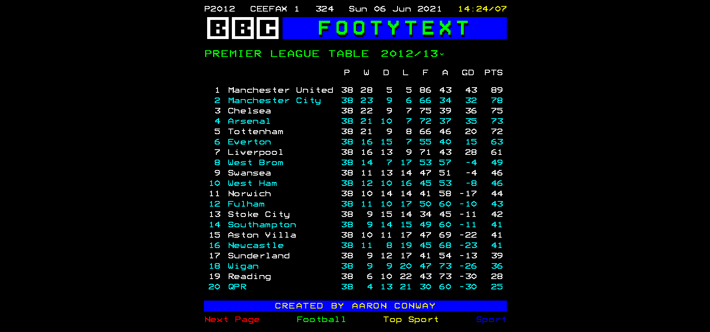

# ⚽ 📺 footytext

[](https://app.netlify.com/sites/footytext/deploys)



> ⚠️ Using free version of API so restricted to 100 requests/day for seasons >= 2015.

View past and present English Premier League tables in a nostalgic teletext/ceefax recreation! Built to practice Vue.

## Stack

-   [NuxtJs](https://nuxtjs.org/) (Vue)

## Build Setup

```bash
# install dependencies
$ yarn install

# serve with hot reload at localhost:3000
$ yarn dev

# build for production and launch server
$ yarn build
$ yarn start

# generate static project
$ yarn generate
```

For detailed explanation on how things work, check out [Nuxt.js docs](https://nuxtjs.org).

## Credits

- API provied by [API-FOOTBALL](https://www.api-football.com/)
- League data < 2015 provided by [jokecamp/FootballData](https://github.com/jokecamp/FootballData)
- Teletext CSS from [Galax](https://galax.xyz/TELETEXT/)